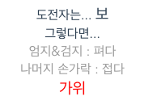

# QUEST

### 항상 이기는 가위바위보 (제한시간: 15~25분)

  - 3개의 컴포넌트가 있다. - Brain, ThumbIndex, OtherFingers
  - Brain 컴포넌트에서 상대가 무엇을 냈는지 미리 알아내어(cheated()) 각 손가락들에게 명령을 주어 최종 결과를 출력 하면 된다.
  ```
  ThumbIndex(엄지,검지) 컴포넌트 '펴다', OtherFingers 컴포넌트 '접다' = 가위
  ThumbIndex(엄지,검지) 컴포넌트 '접다', OtherFingers 컴포넌트 '접다' = 바위
  ThumbIndex(엄지,검지) 컴포넌트 '펴다', OtherFingers 컴포넌트 '펴다' = 보
  ```

  - 위와 같이 Brain 컴포넌트는 손가락(ThumbIndex, OtherFingers)에게 명령을 내린다.

  - 최종 Brain에서 출력되는 값은 아래와 같다.
    ```
      결과값은 Brain 컴포넌트 <span class="result"> 아래의 '결과값'을 지우고 해당자리에 출력하면 된다.
    ```




  - *이벤트 버스를 활용하면 가산점*